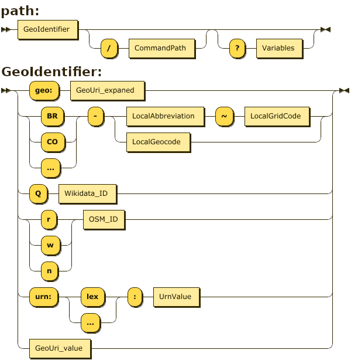
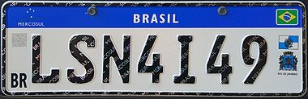

The `osm.codes` domain name and its infrastructure (including this documentation and software) **is a patrimony**. The owner of the patrimony is a [**condominium**](https://pt.wikisource.org/wiki/C%C3%B3digo_Civil_brasileiro/P2.3.3/CAP%C3%8DTULO_VI): a contractual arrangement where ownership over the patrimony is collective, and its sole purpose is to establish the directives and share the costs of maintaining that patrimony. The collective is **a set of organizations** &mdash; government or local NGOs like OpenStreetMap's Chapters &mdash; with entitled to vote through their representatives. The main directive of the OSM-codes Condominium is to maintain a set of web-services as persistent URLs (preserved by decades), to *resolve* Geo URIs and geocodes.

In a [*geocode system*](https://en.wikipedia.org/wiki/Geocode#Geocode_system) context, the "resolution" is a disambiguating process, by providing an standard identifier (or a canonical name), and other optional informations about the geographic entity represented by its identifier.

## The OSM-codes technical proposal and offers

The website and API `osm.codes/{path}` can solve many different types of geocodes, URNs and [Geo URIs](https://inde.gov.br/images/inde/poster3/Expans%C3%A3o%20do%20protocolo%20GeoURI.pdf).

* **Website**: the URL and the *content negotiation* result in an HTML webpage. Through the website the geocodes (and/or use of the GeoURI protocol) can be disclosed to end users.

* **API**: returns JSON, by explicit request (a *path* termined by `.json` or at `api.osm.codes`) or *content negotiation*.

Profile adopted:

* Expanded Geo URI protocol: is the [RFC 5870](https://www.rfc-editor.org/info/rfc5870) syntax (typically `geo:lat,Lon`) augmented by the `geo:osmcode` and `geo:type:geocode` syntaxes, [detailed in this 2020](https://inde.gov.br/images/inde/poster3/Expans%C3%A3o%20do%20protocolo%20GeoURI.pdf), where `type` is controlled by a curator committee of the OSM-codes condominium and the OpenStreetCommunity, and `osmcode` is described in the [OSMcodes specification](osmCodes-geocode_spec).

All profile is

<!-- The `osm.codes` website is also a name and geocode resolution URL. As `doi.org` is committed to solving names in several ways,
-->

### Types of geocodes, URNs and Geo URIs

1. Resolution of **OSM-codes**:  convention established by the "OSM-codes condominium" in consensus with representatives of local jurisdictions, which establishes the *OSM-codes* [*mixed geocode*](https://en.wikipedia.org/wiki/Geocode#Name-and-grid_systems) . The canonical syntax of OSMcode is `{pais2letras}[-{geocodigoNominal}]~{geocodigoDHG}`, where the first part is a name, abbreviation or mnemonic code for the jurisdiction (typically ISO abbreviations), and the second part geocodeDHG, the geocode generated by [*Discrete Hierarchical Grid*](https://en.wikipedia.org/wiki/Geocode#Hierarchical_grids) system (local or global), such as Geohash.

2. Resolution of the protocol [**expanded GeoURI**](https://inde.gov.br/images/inde/poster3/Expans%C3%A3o%20do%20protocolo%20GeoURI.pdf).  Examples: `/geo:-23.5504,-46.634`, `/geo:-23.55,-46.63;u=15`, `/geo:ghs:6gycex`, `/geo:olc:588MC8QV+C`, `geo:iso:br-sp`, `geo:iso_ext:br-sp-campinas`, `geo:lex:br;sao.paulo;campinas`.

   2.1. The geocoding options in the GeoURI standard are neither infinite nor arbitrary, a **curator** will later review and define which ones and which ones to label. At the beginning of the project we closed the following: `ghs` for [classic Geohash](https://www.movable-type.co.uk/scripts/geohash.html) ([PostGIS](https://postgis.net/docs/ST_GeoHash.html)), `ghs-b64` for [OSM's base64 Geohash](https://wiki.openstreetmap.org/wiki/Browsing#Short_links), `ghs-b16h` for [base16h Geohash](http://osm.codes/_foundations/art1.pdf), `olc` for [Open Location Code](https://en.wikipedia.org/wiki/Open_Location_Code), `iso` for [ISO&nbsp;3166-2](https://en.wikipedia.org/wiki/ISO_3166-2), `iso_ext` for extended ISO of jurisdictions, `lex` for [URN Lex](https://en.wikipedia.org/wiki/Lex_(URN)) jurisdictions. <!-- Wikidata ID https://wiki.openstreetmap.org/wiki/Permanent_ID/Proposal-QID  -->

   2.2. Some exotic variants just to exemplify implementations that we have developed: `br-cep` for the Brazilian postal code in force in 2022, `br-ibge2020` for the IBGE Statistical Grid still in force in 2022. Examples: `geo:br-cep:04569-010` (resolution hierarchical by jurisdictions and [CRP database](https://github.com/AddressForAll/CRP))) and `geo:br-ibge2020:100KME4600N1095` (see [project BR_IBGE](https://github.com/osm-codes/BR_IBGE/blob/main/data/grid_ibge100km.geojson)).

3. Resolution of **OSM Identifiers**: analogous to the resolution of Wikidata identifiers, delegates resolution. Syntax: Prefixes `r` for *relation*, `w` for *way* and `n` for *node*, followed by 2 or more digits. This avoids the risk of conflict with 3-digit iso country codes, which in the future may be an option for ISO-alpha2.

4. Resolution of **URN Lex prefixes**: the official portal [www.lexml.gov.br](https://www.lexml.gov.br) makes use of [Lex URNs](https://en.wikipedia.org/wiki/Lex_(URN)), whose prefix (jurisdiction) is a *nominal geocode* (also resolved by `geo:lex`). Examples: `/urn:lex:br;sao.paulo;campinas` (canonical),  `/urn:lex:br;sp;cam` (reference).

5. Resolution of **Wikidata** identifiers relating to geographical entities: from a [bakery](https://www.wikidata.org/wiki/Q41796695)   or [museum](https://www.wikidata.org/wiki/Q82941), to a [country](https://www.wikidata.org/wiki/Q739). The final resolution of valid codes is done by consulting the Wikidata API on the server. Example: `Q739` for Colombia jurisdiction, `Q41796695` for a business address in Brazil. The syntax "`Q` prefix" followed by 2 or more digits has no risk of ambiguity.

<!-- On the website, the URL with this type of *path* must return a standardized information page, highlighting the geographic representation of the entity represented by the geocode.-->

### Generic endpoint syntax

To implement the different types (of geocodes, URNs and GeoURIs) in the same domain and guaranteeing short URLs, the following syntax was agreed in the webpages and API-endpoints:

<!--  https://bottlecaps.de/rr/ui
/* OSM.codes endpoint path
 * See http://osm.codes
 */

path
         ::= GeoIdentifier ('/' CommandPath)?  ('?' Variables)?

GeoIdentifier
         ::= ('geo:' GeoUri_expaned)
           | ( ('BR' | 'CO' | '...' )  '-' ((LocalAbbreviation '~' LocalGridCode) | LocalGeocode ) )
           | ('Q' Wikidata_ID)
           | ( ('r' | 'w' | 'n') OSM_ID )
           | ( 'urn:' ('lex'|'...') ':' UrnValue )
           | GeoUri_value
-->

Both, website and API, use the same `path` general endpoint syntax, to support the "many types" of geocodes and protocols:

Examples of GeoURI: `geo:-23.5504,-46.634`, `geo:-23.55,-46.63;u=15`... And expanded GeoURI:  `geo:ghs:6gycex`, `geo:olc:588MC8QV+C`, `geo:iso:br-sp`, `geo: iso_ext:br-sp-campinas`, `geo:lex:br;sao.paulo;campinas`.

Examples of OSMcodes: `CO-ANT-Itagui-O~UWC`, `BR-SP-CAM~12345`.

<!--

Exemplos de interface de referência para a criação da nossa:
* [geohack da Wikipedia](https://geohack.toolforge.org/geohack.php?pagename=S%C3%A3o_Paulo_Museum_of_Art&params=23.5611_S_46.6558_W_type:landmark).
 * [movable-type/geohash](https://www.movable-type.co.uk/scripts/geohash.html)
 * [osm.org](https://osm.org)
 * plus.codes
 * ...
-->

## Font for standard geocode layout

The typographic font used on Mercosur license plates, [FE-Schrift](https://pt.wikipedia.org/wiki/FE-Schrift), is demonstrably more readable (for humans and computers), avoiding ambiguity between letters. When dealing with mixed geocode (eg `CO-MAG-SantaMaria~3T6L.L1K`), use, as on the plate, the nominal prefix (`CO-MAG-SantaMaria`) with a smaller font size (from 50% to 75%).

