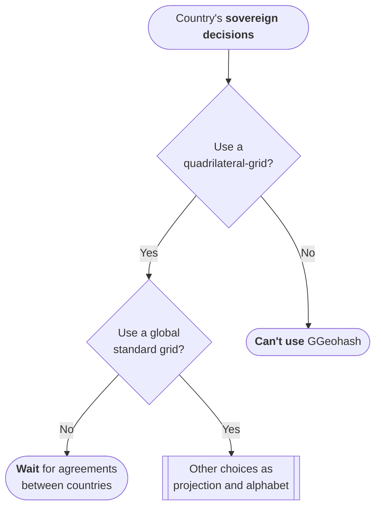
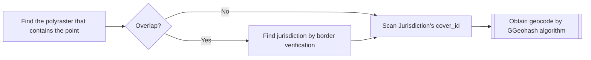

The OSMcodes Geocode

The main syste

The set of all countries is the "root set" of the [jurisdiction](https://en.wikipedia.org/wiki/Jurisdiction) hierarchy,
and **each country has its local official geocode**, due to the sovereignty of nations over their geocodes.

## The GGeohash and other grid-based geocodes

## Countries sovereign decisions

The OSM-codes

## Jurisdiction resolution of a LatLon point

In a [*geocode system*](https://en.wikipedia.org/wiki/Geocode#Geocode_system) context,
the "resolution" is a disambiguating process, by providing an ID or a canonical name.

The set of all countries is the "root set" of the [jurisdiction](https://en.wikipedia.org/wiki/Jurisdiction) hierarchy,
and **each country has its local official geocode**, due to the sovereignty of nations over their geocodes.
Even the set of [international waters](https://en.wikipedia.org/wiki/International_waters) is also a jurisdiction, like a big country.
So, jurisdiction resolution starts with the **country resolution**, and the set of all crontries (or contry-like regins)
forms a [mosaic](https://en.wikipedia.org/wiki/Tessellation) over the globe.

All country's geocode system is based in a *quadrilateral [hierarchical grid](https://en.wikipedia.org/wiki/Geocode#Hierarchical_grids)*
with refinement resolution of "powers of 2" (see illustrative table).  The "root grid", that is a set of ***cover cells***,
has square cells of side size at the top of the  "powers of 2" table (see levels 0 to 5).
For example the Colombian geocode system starts with a cover of ~262&nbsp;km (illustered bellow) and Brasil with&nbsp;~524&nbsp;km&nbsp;(2×262.144).

So, each "root cell" is a quadrilateral polygon, and the country's ***cover polygon*** is the union of all country's root cells is a raster-like polygon.
Some cover polygons will be overlap with others, so, to be a ***global cover mosaic***, the  *cover polygons* are cutted at the overlaps.
The pieces of this mosaic are all raster-like polygons, so it will be called *polyraster* geometries.

There are two types of ***polyraster* regions***:

* **Defined**, with a defined jurisdiction. Solved the jurisdiction resolution.
* **Overlap**, with multiple jurisdictions. Requires accurate border verification for resolution.

After jurisdiction resolution we need to find the local *cover polygon* (`cover_id`) where the *sample point* is contained.
The Generalized Geohash algorithm will be applied to this `cover_id` to encode the *sample point*
into a geocode (see [encode/decode Generalized Geohash functions](https://github.com/AddressForAll/pg_pubLib-v1/blob/main/src/pubLib05hcode-encdec.sql)).
Below the whole algorithm, represented as *flowchart*:

The first step at GGeohash algorithm is to transform the *sample point* by the country's official [equal-area projection](https://en.wikipedia.org/wiki/Equal-area_map), and use a **normalized coordinate system *UV*** instead *XY*. See functions [`str_ggeohash_uv_encode()` and `str_ggeohash_uv_decode_box()`](https://github.com/AddressForAll/pg_pubLib-v1/blob/main/src/pubLib05hcode-encdec.sql#L200). After it, the [space-filling curve](https://ppkrauss.github.io/Sfc4q/) (Hilber or Morton) elected by jurisdiction will be used to to generate the code of the normalized cover cell.

### Normalization relations
Definitions in the case of Colombia:

* `XY` is the result of the official transformation (for example in Colômbia it is from `SRID=4326` to the `SRID=9377`).
* `UV` is the normalized coordinates.
* `L0_bbox = array[min_x, min_y, max_x, max_y]`;
* `u = (x-min_x)/(max_x-min_x)`
* `v = (y-min_y)/(max_y-min_y)`

To get XY coordionates from UV:
* `x = max_x - u*(max_x-min_x)`
* `y = max_y - v*(max_y-min_y)`
